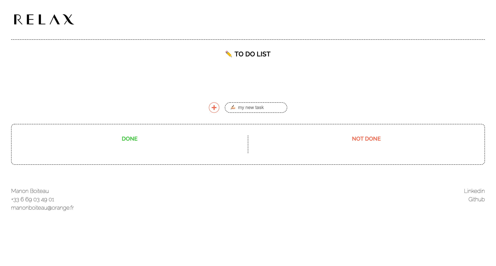

# TO DO LIST ✏️

🌨 February 2022  
✨ Frontend

## 🌈 Overview - Welcome dude

---

To do list made for a technical test.  
1 screen for web only (responsive needs to be done).

## 👩🏻‍💻 Tasks

---

✘ Use JSX and components  
✘ Create a task : add a task, checkbox, delete a task  
✘ Put tasks into a 2 columns table: "done" and "not done"

## 📚 Stacks

---

[Javascript](https://www.w3schools.com/js/default.asp)  
[ReactJS](https://fr.reactjs.org/docs/getting-started.html)  
[HTML5](https://www.w3schools.com/html/default.asp)  
[CSS3](https://www.w3schools.com/css/default.asp)

## To be continued

---

✘ Drag & drop feature for moving tasks from "done" column to "not done" column or the other way around.  
✘ Responsive design

## 🗝 Installation and usage

---

Be sure, you have installed all dependencies and applications to run the project on your computer.

### 🚙 Running the project

1️. Clone this repository

`git clone https://github.com/manon-boiteau/relax-test.git`  
`cd relax-test`

2️. Install packages

`npm install`  
or  
`yarn`

3️. When installation is complete:

`yarn start`
